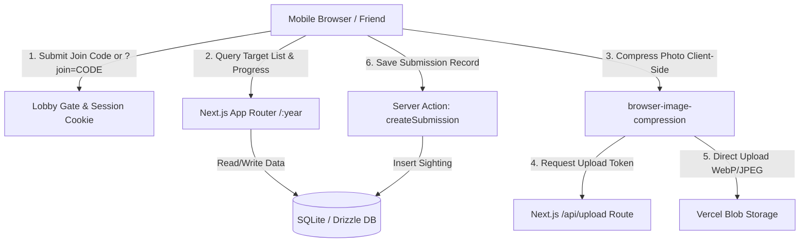

# Requirements

### Overview & Goals
The **Venture Compound Scavenger Hunt** web application is a lightweight, mobile-first platform for a group of friends attending **DragonCon**. It provides a shared checklist to spot, photograph, and log cosplayers throughout the convention, separating hunts into yearly sessions while preserving photo archives.

### Scope
- **In Scope**:
  - Year-based session routing (`/:year`) with current year redirect.
  - Lobby-style join code gate (e.g., `VENTURE26` or invite links `?join=VENTURE26`) with browser cookie persistence.
  - Target list management with bulk line-by-line / CSV import for organizers.
  - Mobile-first photo capture with client-side compression (~300–600 KB) and direct blob upload to Vercel Blob.
  - Mission Progress Gauge (threat level / power meter) tracking completion percentage.
  - Target filtering (`All`, `Found`, `Needed`), real-time search, and full-screen photo gallery / lightbox.
  - Themed UI blending *The Venture Bros.* retro-futurism (orange, cream, navy, purple, gold) and *DragonCon* culture (Marriott Marquis carpet motif, dragon iconography, con badge ribbons).
- **Out of Scope**:
  - Multi-team competitive scoring and leaderboards.
  - Personal user accounts, passwords, or OAuth workflows.
  - Automated AI photo recognition or GPS geofencing.

### User Stories
- **As a Participant**:
  - I want to open a shareable link on my phone and enter the join code (or click an invite link) so I can immediately view the target list.
  - I want to tap a target, snap a photo with my phone camera, enter my name, and upload it without upload failures on busy convention cellular networks.
  - I want to see how many cosplayers our group has spotted on a retro progress meter so we stay motivated during the con.
  - I want to browse past years' photo galleries to relive previous DragonCon hunts.
- **As an Organizer**:
  - I want to create a new year session and set a join code.
  - I want to paste a list of 20–50 cosplayers to bulk-populate the year's targets in seconds.

# Technical Design

### Current Implementation & Tech Stack
- **Framework**: Next.js 16.2 (App Router), React 19, TypeScript 5.
- **Styling**: Tailwind CSS v4 (`@tailwindcss/postcss`) with custom inline theme tokens.
- **Database**: SQLite via Drizzle ORM (supporting local SQLite file for development and Turso / libSQL for production zero-maintenance deployments).
- **Blob Storage**: Vercel Blob (`@vercel/blob`) with client direct upload tokens.
- **Client Compression**: `browser-image-compression` for resizing mobile camera photos down to 1080p WebP/JPEG (~300–600 KB) prior to network transmission.

---

### Key Architecture Decisions
1. **Lightweight Access Control**: Shared lobby passphrase per year stored in an `httpOnly` or local session cookie. Eliminates user account databases and login friction while keeping the hunt private to friends.
2. **Direct-to-Blob Client Uploads**: Mobile photos are compressed in the browser and sent directly to Vercel Blob using pre-signed upload tokens, bypassing Next.js serverless payload limits.
3. **SQLite with Drizzle ORM**: Simplifies database management to a single lightweight schema without dedicated server infrastructure.

---

### Architecture & Data Flow Diagram



---

### Data Models & Schema (`lib/db/schema.ts`)

```typescript
// Years / Sessions
export const years = sqliteTable('years', {
  id: text('id').primaryKey(),
  year: integer('year').notNull().unique(), // e.g., 2026
  title: text('title').notNull(),          // e.g., "DragonCon 2026 Hunt"
  joinCode: text('join_code').notNull(),   // e.g., "VENTURE26"
  isActive: integer('is_active', { mode: 'boolean' }).default(true),
  createdAt: integer('created_at', { mode: 'timestamp' }).notNull()
});

// Target Cosplay Checklist Items
export const targets = sqliteTable('targets', {
  id: text('id').primaryKey(),
  yearId: text('year_id').notNull().references(() => years.id),
  name: text('name').notNull(),             // e.g., "Brock Samson in speedo"
  description: text('description'),         // e.g., "Usually near the pool or Hyatt"
  categoryTag: text('category_tag'),        // e.g., "Team Venture", "Guild", "Henchmen"
  status: text('status', { enum: ['NEEDED', 'FOUND'] }).default('NEEDED'),
  orderIndex: integer('order_index').default(0),
  createdAt: integer('created_at', { mode: 'timestamp' }).notNull()
});

// Photo Sighting Submissions
export const submissions = sqliteTable('submissions', {
  id: text('id').primaryKey(),
  targetId: text('target_id').notNull().references(() => targets.id),
  imageUrl: text('image_url').notNull(),
  photographerName: text('photographer_name'), // e.g., "Hank"
  caption: text('caption'),
  createdAt: integer('created_at', { mode: 'timestamp' }).notNull()
});
```

---

### Project File Structure

```
venture-scavenger-hunt/
├── app/
│   ├── [year]/
│   │   ├── page.tsx               # Main target checklist & gallery for the year
│   │   ├── layout.tsx             # Year wrapper with lobby auth check & navigation
│   │   └── admin/
│   │       └── page.tsx           # Organizer bulk target entry & session settings
│   ├── api/
│   │   ├── auth/verify/route.ts   # Join code verification & cookie generation
│   │   └── upload/route.ts        # Vercel Blob client upload token handler
│   ├── globals.css                # Tailwind v4 theme tokens (Venture/DragonCon colors)
│   ├── layout.tsx                 # Root layout with Geist fonts
│   └── page.tsx                   # Redirects to active year (e.g. /2026)
├── components/
│   ├── auth/
│   │   └── LobbyGate.tsx          # "Compound Security Checkpoint" pin/code entry
│   ├── layout/
│   │   └── HeaderNav.tsx          # Header with con badges, active year & switcher
│   ├── progress/
│   │   └── MissionGauge.tsx       # Retro ray-gun/power meter completion bar
│   ├── targets/
│   │   ├── TargetCard.tsx         # Dossier / badge checklist card
│   │   ├── TargetFilterBar.tsx    # Search, category tag pills, status filters
│   │   └── BulkTargetModal.tsx    # Line-by-line / CSV import modal
│   ├── submissions/
│   │   ├── PhotoUploadModal.tsx   # Camera trigger, client compressor, name input
│   │   ├── PhotoGallery.tsx       # Visual grid of spotted cosplayers
│   │   └── Lightbox.tsx           # Full-screen photo view
│   └── ui/
│       ├── RetroButton.tsx        # Chunky 70s tactile button
│       ├── BadgeRibbon.tsx        # Hanging con ribbon tag
│       └── CarpetPattern.tsx      # SVG Marriott Marquis carpet diamond motif
├── lib/
│   ├── actions/                   # Next.js Server Actions (targets, submissions, years)
│   ├── db/                        # Drizzle ORM client, schemas, and migrations
│   ├── session.ts                 # Lobby session token helpers (cookies/localStorage)
│   └── utils/
│       ├── image-compression.ts   # Client-side canvas/browser image compression
│       └── rank-titles.ts         # Progress milestone titles (Henchman -> Sovereign)
└── requirements.md
```

# Testing

### Validation Approach
Verification will focus on functional correctness, responsive mobile usability, client-side photo compression, direct blob uploads, and lobby code security.

### Key Scenarios
1. **Lobby Gate & Access Control**:
   - Direct visit to `/2026` shows the "Compound Security Checkpoint" if unauthenticated.
   - Entering the correct join code unlocks the hunt and sets persistent session cookie.
   - Opening `/2026?join=VENTURE26` automatically validates and unlocks the year without requiring manual entry.
   - Entering an invalid code displays a styled "ACCESS DENIED / SECURITY ALERT" warning.
2. **Target List Management & Ingestion**:
   - Organizer pastes a 20-line text list into `BulkTargetModal` and creates all 20 targets in order.
   - Targets display correct category badges and initial `NEEDED` status.
3. **Photo Capture & Client Compression**:
   - Selecting a target opens `PhotoUploadModal` with mobile camera trigger.
   - Uploading a 5 MB phone camera photo triggers `browser-image-compression` and outputs a ~350 KB WebP/JPEG.
   - Photo is uploaded directly to Vercel Blob and a submission record is created with photographer credit.
   - Target status updates from `NEEDED` to `FOUND` and completion gauge increments.
4. **Filtering & Progress**:
   - Toggling between `All`, `Needed`, and `Found` updates the list instantaneously.
   - Real-time search filters matching character names and tags.
   - Mission Progress Gauge reflects accurate ratio (e.g., `12 / 20 Cosplayers Found (60%)`) and updates the milestone title.
5. **Year Navigation & Archive**:
   - Switching years in `HeaderNav` loads historical sessions (e.g. `/2025`) and displays archived photo galleries.

### Edge Cases
- **Duplicate Uploads**: Target supports multiple photos from different friends without overwriting previous sightings.
- **Corrupted / Huge Files**: Client compressor safely falls back or rejects invalid non-image formats with clear feedback.
- **Offline / Spotty Network**: User receives clear feedback if direct blob upload is interrupted, with retry capability.

# Delivery Steps

### ✓ Step 1: 1. Database schema, storage integration, and data access layer
Set up the database schema and storage client to support yearly sessions, targets, and photo submissions.

- Configure Drizzle ORM with SQLite (libSQL / Turso or local SQLite for development) in `lib/db/`.
- Define schema tables in `lib/db/schema.ts`:
  - `years`: `id`, `year` (e.g. 2026), `name`, `join_code` (hashed or uppercase string), `is_active`, `created_at`.
  - `targets`: `id`, `year_id`, `name`, `description`, `category_tag`, `status`, `order_index`, `created_at`.
  - `submissions`: `id`, `target_id`, `image_url`, `photographer_name`, `caption`, `created_at`.
- Set up migration / push scripts and database connection helper in `lib/db/index.ts`.
- Set up Vercel Blob client upload helper and route handler in `app/api/upload/route.ts` with direct upload tokens.

### ✓ Step 2: 2. Design system, theming tokens, and UI primitives
Establish the retro Venture Bros and DragonCon visual language across Tailwind CSS and core reusable UI components.

- Configure Tailwind CSS v4 custom theme tokens in `app/globals.css` (Venture orange, cream, navy, Monarch gold, Guild purple, Henchman red, con carpet hues, retro box shadows).
- Create SVG assets and canvas utilities for DragonCon dragon iconography, Marriott Marquis carpet diamond motif, and badge ribbon borders in `components/ui/`.
- Build core retro UI primitives:
  - `RetroButton`: Tactile chunky button with offset borders and active click state.
  - `BadgeRibbon`: Hanging satin ribbon tag for statuses and categories.
  - `RetroCard`: Dossier / classified document panel styling with drop shadow.
  - `HeaderNav`: Navigation bar displaying the active con year, con badges, and year switcher dropdown.

### ✓ Step 3: 3. Lobby access gate, session validation, and year routing
Implement route protection with lobby join codes, cookie-based session persistence, and year switching.

- Create session management utilities in `lib/session.ts` to manage client cookie/localStorage access tokens for unlocked years.
- Implement the "Compound Security Checkpoint" lobby gate in `components/auth/LobbyGate.tsx`:
  - Tactile keypad/input for lobby code.
  - Auto-unlock support via query parameter (e.g. `/:year?join=CODE`).
- Build year route layout in `app/[year]/layout.tsx` that checks lobby authentication before granting access to the hunt.
- Implement the home page redirect in `app/page.tsx` to forward users to the active year route (e.g. `/2026`) or year selector.

### ✓ Step 4: 4. Target list management and bulk ingestion
Build the target list view, category filtering, search, and bulk list ingestion for organizers.

- Implement Server Actions in `lib/actions/targets.ts` to fetch, create, and bulk-import target cosplayers.
- Create the target checklist container and item cards in `components/targets/`:
  - `TargetCard`: Displays character name, hints/tags, status ribbon (`FOUND` / `NEEDED`), and quick action buttons.
  - `TargetFilterBar`: Instant search input and filter toggles (`All`, `Needed`, `Found`).
- Create `BulkTargetModal` in `components/admin/BulkTargetModal.tsx` allowing line-by-line paste or CSV import of the annual con list.
- Add admin controls to create a new year and configure its target list and join code.

### ✓ Step 5: 5. Photo capture, client compression, and sighting gallery
Build the mobile camera capture workflow with client-side compression, direct upload, and gallery tracking.

- Implement client-side image compression in `lib/utils/image-compression.ts` (resizing high-res photos to ~1080p, 300–600 KB WebP/JPEG before upload).
- Create `PhotoUploadModal` in `components/submissions/PhotoUploadModal.tsx`:
  - Direct mobile camera trigger (`<input type="file" accept="image/*" capture="environment" />`).
  - Optional photographer credit input (persisted in browser localStorage) and caption field.
  - Progress bar showing client compression and direct-to-blob upload progress.
- Build the "Mission Progress Gauge" in `components/progress/MissionGauge.tsx` with retro power meter styling and rank milestones (e.g., *Level 1 Henchman* → *Guild Sovereign*).
- Create `PhotoGallery` in `components/submissions/PhotoGallery.tsx` and full-screen lightbox image viewer.